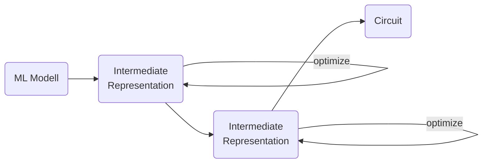

# Introduction

Deep learning has made our lives greater in many regards. For the most part, machine learning models are deployed on the cloud. With no internet connection, however, we are out of luck. The natural solution is to make the machine learning models smaller, such that they can be deployed locally. This is fine for modern mobile phones, but what about devices with very little computing power, e.g., smart wearables and smart sensors. Here we must make the model even smaller.

Once we have made the model smaller, we can put the model on a FPGA. This might work in many fields, but FPGAs are rather expensive and have relatively high power consumption. If, for examle, we wanted to locally enhance the audio of a hearning aid via a ML-based solution, the hearning aid might run out of battery too soon.

Another approach is to turn the ML model into a circuit, i.e., what used to be software is now hardware. This way we can have ML on a tiny cost-efficient electronic device with good battery life. Thus, in this blog post, we will look at serveral schemes how to come up with a circuit that represents a ML model.

# Approach

First of all, I should say that there are two ways how to approach this: take an existing ML model and convert it to a circuit or have an ML algorithm that directly outputs a circuit. The ladder seems convenient, but it very hard to learn a circuit directly, i.e., the resulting models will have very low predictive power. So we will look at the fomer method.

Decision trees are a good candidate to be converted into a circiut. We just have to turn turn each node into a comparator circuit and quantize the output. Other accumulators, comparators and decoders can be hand-programmed. At the [IWLS 2021 contest](https://www.iwls.org/contest/2021/IWLS21_Contest_Slides.pdf), XGBoost converted to circuit won.

One problem is, though, that going directly to circuit structure might not be a good idea. Usually, we want to have multiple steps in between, so that we can optimize (in terms of accuracy and node count) at each conversion step and at each intermediate level.

Neural networks are a promising method for various reasons. For one, there is already significant research about how to make neural networks tiny, e.g., this paper shows a NN with AlexNet-like performance running on a device with just 320kB of memory . We can thus just take tinyML results and start from there.

One paper does exactly this; they take a quantized neural network and condense it by detecting sub-adder sharing . For example, if $X = A + B + C +D$ and $Y = B + C + D + E$, then you can share $B + C + D$. They then translate the network to Verilog format and compile the cirucit using Vivado, which is a software used for working with FPGAs.

Since we are are not looking for FPGA deployment here, we would actually convert the Verilog to an and-inverter graph (AIG) . An example of this format is illustrated below. Nodes depict the AND operation and the black dots are negation. This illustration is the same as $\lnot 6 \wedge (2 \wedge 4)$.

{:refdef: style="text-align: center;"}
{: width="200"}
{:refdef}

Finding good intermediate representations is crucial, and lookup-table nets (LUT nets) are a good candidate. The image below illustrates how they basically work. You can also read about them in my [Master Thesis](https://epub.jku.at/obvulihs/download/pdf/7851313?originalFilename=true).

{:refdef: style="text-align: center;"}
{: width="450"}
{:refdef}

A paper working with LUT networks is this one . They start with an Xnor-net  and find an efficient mapping to a LUT network, which is the main contribution of their paper. Same as before, they then produce a Verilog file which they pass to Vivado.

Once we are at LUT network level, we could try some learning algorithm to try to recover accuracy, in case we lost some. For example, the Muesli algorithm  seems suitable. This algorithm performs gradient descent on the mutual information between a set of nodes and the labels. The Muesli algorithm has been around since 1993 and recently has been gaining traction, as visible in the figure below.

{:refdef: style="text-align: center;"}
{: width="400"}
{:refdef}

# Challenges

As of the time of writing this post, approximate logic gate synthesis is a rather obscure research topic, so there is a lack of papers.

Furthermore, the results of different papers are hard to compare because the output format is not standardized:* If one paper says "We obtain an AIG with a number of $X$ nodes." and another paper "Vivado tells us following about the cirucit performance...", then there is no direct comparison. The paper  acknowledges this and they go to great lengths to try to compare their results to others'.

It would also be useful to establish "leages" of node count or some other measure of complexity for comparison. For example, in the IWLS 2021 challenge they had three leagues: A maximum of 10,000, 100,000 and 1,000,000 AIG nodes.

# Further Reading

If you would like to get into approximate logic gate synthesis, the IWLS 2020 paper  is a good start. In [this post](), I give various links concerning the IWLS challenges.

# References



