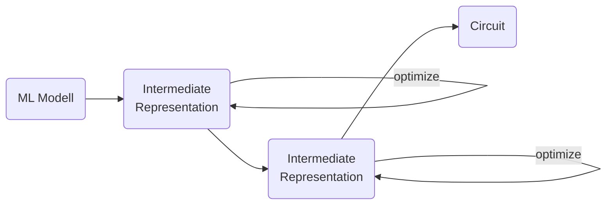

# Introduction

Deep learning has made our lives greater in many regards. For the most part, machine learning models are deployed on the cloud. With no internet connection, however, we are out of luck. The natural solution is to make the machine learning models smaller, such that they can be deployed locally. This is fine for modern mobile phones, but what about devices with very little computing power, e.g., smart wearables and smart sensors. Here we must make the model even smaller.

Once we have made the model smaller, we can put the model on a FPGA. This might work in many fields, but FPGAs are rather expensive and have relatively high power consumption. If, for examle, we wanted to locally enhance the audio of a hearning aid via a ML-based solution, the hearning aid might run out of battery too soon.

Another approach is to turn the ML model into a circuit, i.e., what used to be software is now hardware. This way we can have ML on a tiny cost-efficient electronic device with good battery life. Thus, in this blog post, we will look at serveral schemes how to come up with a circuit that represents a ML model.

# Approach

First of all, I should say that there are two ways how to approach this: take an existing ML model and convert it to a circuit or have an ML algorithm that directly outputs a circuit. The ladder seems convenient, but it very hard to learn a circuit directly, i.e., the resulting models will have very low predictive power. So we will look at the fomer method.

Decision trees are a good candidate to be converted into a circiut. We just have to turn turn each node into a comparator circuit and quantize the output. Other accumulators, comparators and decoders can be hand-programmed. At the IWLS 2021 contest, XGBoost converted to circuit won.

One problem is, though, that going directly to circuit structure might not be a good idea. Usually, we want to have multiple steps in between, so that we can optimize (in terms of accuracy and node count) at each conversion step and at each intermediate level.

Neural networks are a promising method for various reasons. For one, there is already significant research about how to make neural networks tiny, e.g., this paper shows a NN with AlexNet-like performance running on a device with just 320kB of memory . We can thus just take tinyML results and start from there.

# References



